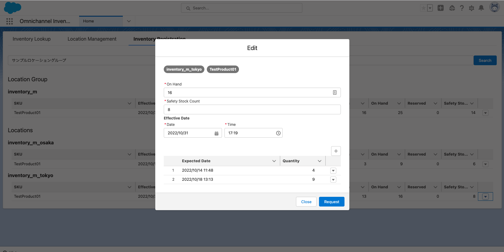

# OCI Inventory Registration
This Component is used to edit inventory info in Platform UI.

You can see list of locations. 


You can edit inventory info.


You can see future inventory info.


## Sample Data
```
sfdx force:apex:execute -f sample_data/data.apex
```

