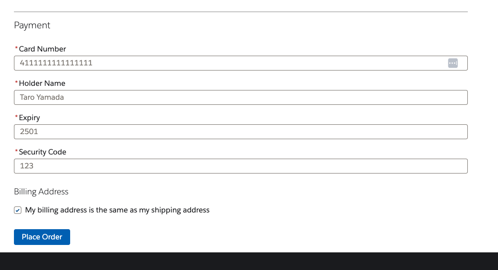
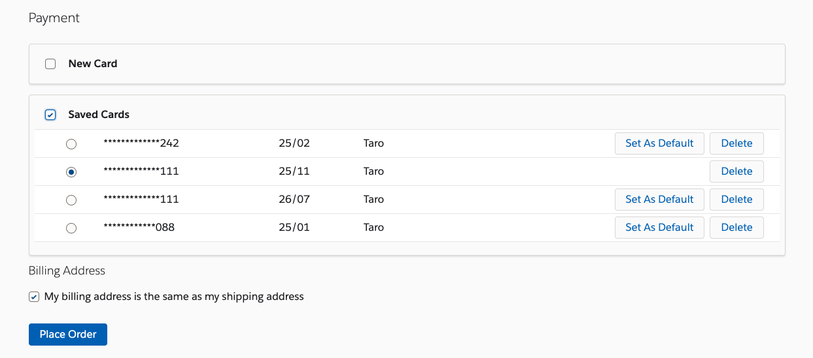
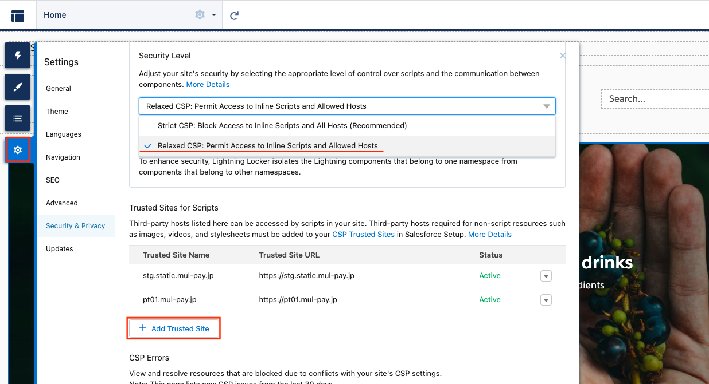

# Sample GMO Payment Adapter
This sample package contain component to implement client side tokenization flow payment without 3DS.

You can use new card and save it.

You can choose a card from saved list.


## Setting instruction
1. Replace `{your shop id}`, `{your shop pass}`, `{your site id}`, `{your site pass}` in `force-app/main/default/customMetadata/GMO_Configuration.GMOClientConfiguration.md-meta.xml` with GMO credentials. 
1. Replace `{your shop id}`, `{your shop pass}`, `{your site id}`, `{your site pass}` in `force-app/main/default/namedCredentials/GMOAdapterShop_NC.namedCredential-meta.xml` and `force-app/main/default/namedCredentials/GMOAdapterSite_NC.namedCredential-meta.xml` with GMO credentials. 
1. Push/Deploy source to your org.
1. (You can also set up above through platform screen. Setup > Named Credentials. Setup > Custom Metadata Types)
1. Create PaymentGateway record with command below. Replace `{your org user}` with user alies or ID of an org you prefer to use.
    ```
    sh scripts/shell/payment.sh -u {your org user} -a GMOPaymentAdapter -n GMOAdapterShop_NC
    ```
1. Select `GMOPaymentAdapter_Gateway` in Link Integration setting
    
1. Set up Trusted Sites in Experience Builder for `https://stg.static.mul-pay.jp` and `https://pt01.mul-pay.jp`.
    
1. Assign access to Apex `GMOPaymentController` to shopper profile. (Setup > Apex Classes > Security in `GMOPaymentController`)


## Out of scope for now(2022/02)
- Refund, Return, Cancel, Capture