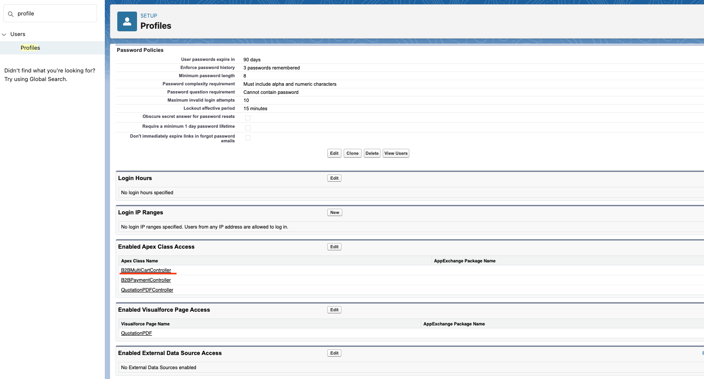
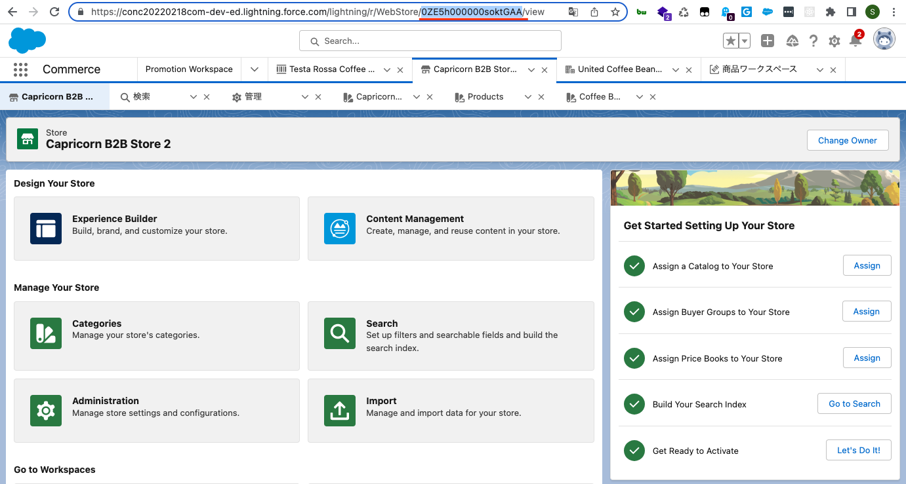
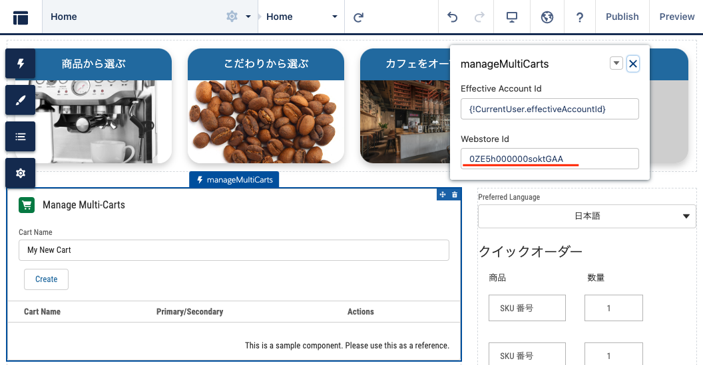

# B2B Commerce Multi Cart Management Sample Component
You can manage multi cart (create, delete, set as promary) with this component

## Setting Instruction
1. Give profile assigned to login user an access to Apex class `B2BMultiCartController`.
    

1. Take webstore ID from platform URL
    

1. Drag and drop `Multi Cart Management Component` to a place you prefer. and put webstore ID as an argument.
    

