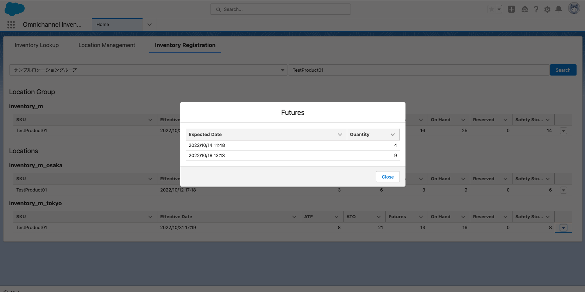
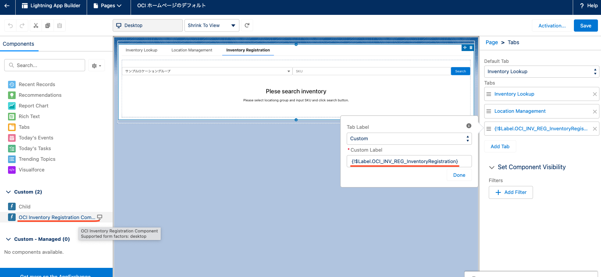

# OCI Inventory Registration
This Component is used to edit inventory info in Platform UI.

You can see list of locations. 


You can edit inventory info.


You can see future inventory info.


## Add this component to page
You can add this component named "OCI Inventory Registration Component" to any page and you can also use custom label named "OCI_INV_REG_InventoryRegistration".




## Sample Data
```
sfdx force:apex:execute -f ./scripts/apex/data.apex
```

