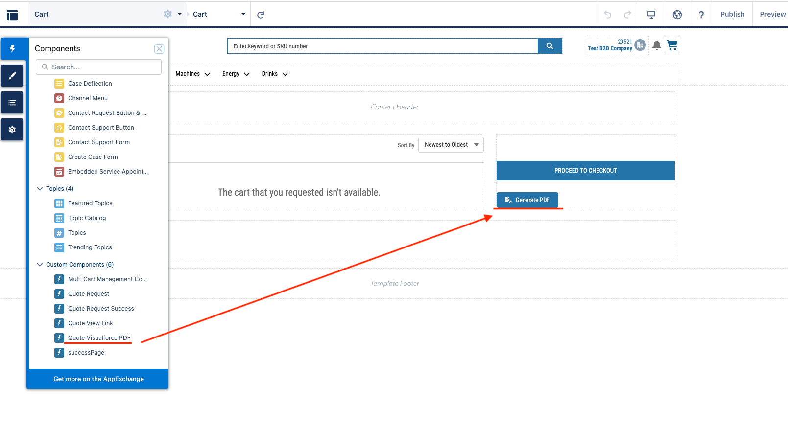
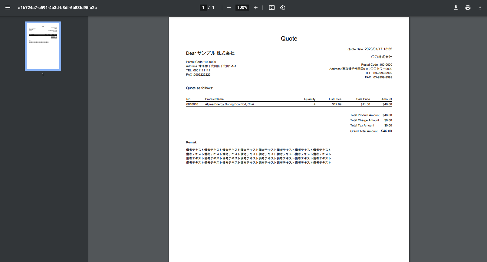
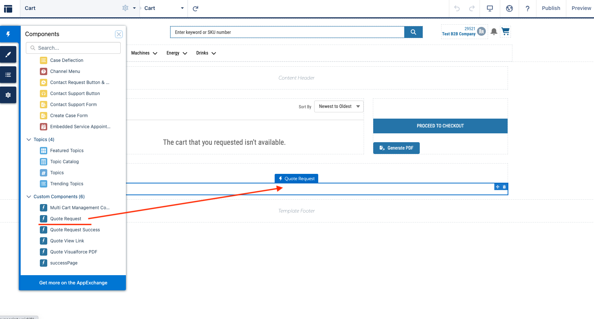
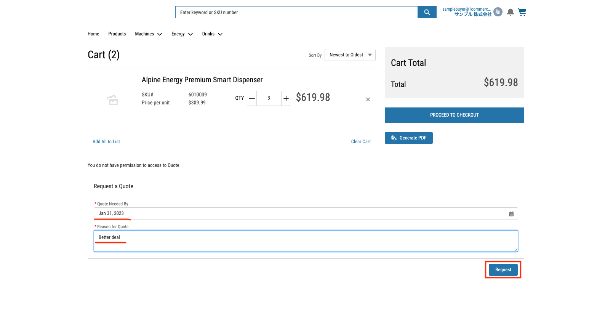
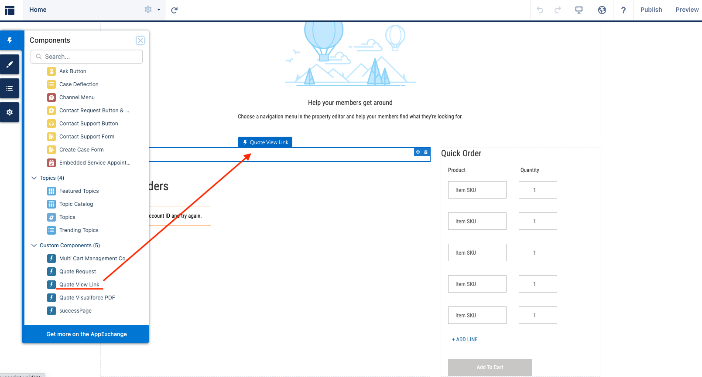
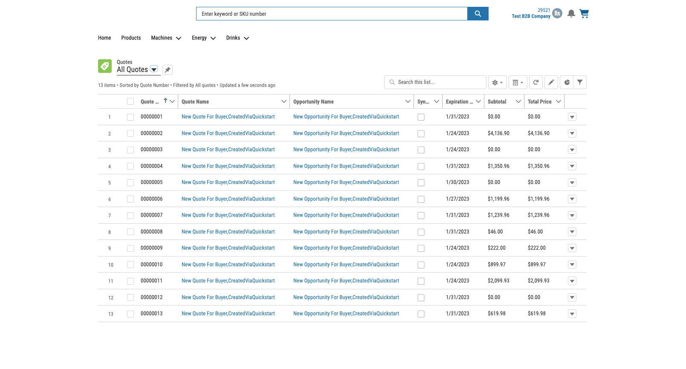

# Quote
This package contain 3 component
1. Button to genarate quote PDF with cart information.
1. Screen flow to request quote
1. Link to quote list view

## Component setting instruction
### Button to genarate quote PDF with cart information
In Experience Builder, you can drag and drop `Quote Visualforce PDF` component to cart page.

When you click the button, PDF is genarated and popup new window to show it.

### Screen flow to request quote
**Warning**
This component is available only if you have license which allow you to use Quote object.

In Experience Builder, you can drag and drop `Quote Request` component to cart page.

In cart page, you can fill out request form and submit it. 

**Note**
You can modify logic to create Quote object in flow `Request a Quote`.

### Link to quote list view
**Warning**
This component is available only if you have license which allow you to use Quote object and user is assigned profile which have access to it.

In Experience Builder, you can drag and drop `Quote Request` component to any page.

When you click the link, Quote list is shown.

## Permission setting instruction
1. Grant permissions to the APEX class
    1. Login to the org.
    1. Go to Setup -> Custom Code -> APEX Classes.
    1. On the `QuoteVFPDFController` and `QuoteRequestController` class, click "Security".
    1. Assign the buyer user profile(s) or other user profiles that will use your components.
    1. Click Save.
1. Grant permissions to the Visualforce class
    1. Login to the org.
    1. Go to Setup -> Custom Code -> Visualforce Pages.
    1. On the `QuoteVFPDF` class, click "Security".
    1. Assign the buyer user profile(s) or other user profiles that will use your components.
    1. Click Save.
