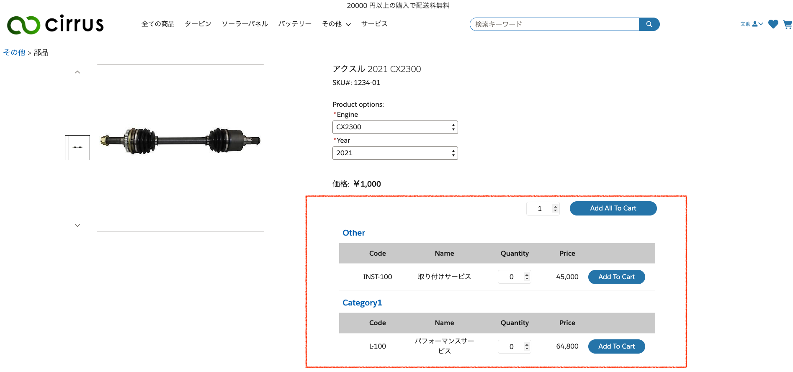
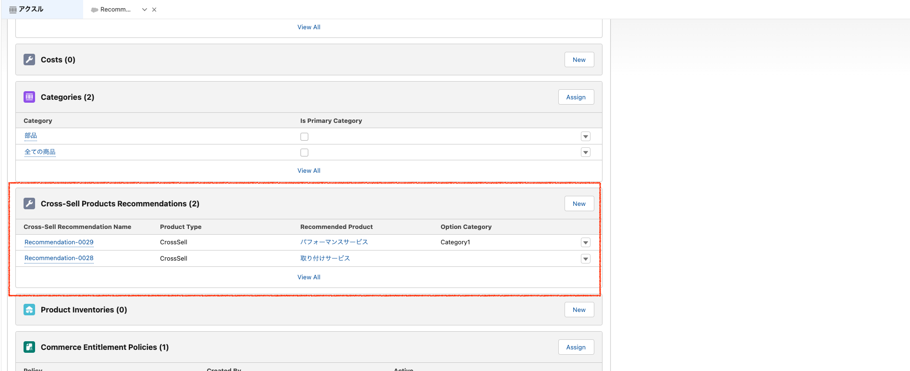

# Sample cross sell recommendation component
You can use this sample component to implement manual cross sell recommendations in PDP.
User can add each item or all item at the same time.

Set up items you want to show as recommendation in Product2 object page.

## Setup Instruction
1. Deploy all source code to your org.
1. Assign access to Apex `CrossSellProductsController` to shopper profile. (Setup > Apex Classes > Security in 'CrossSellProductsController')
1. Assign read access to custom object `Cross_Sell_Recommendations__c` to shopper profile.
1. Add `Cross_Sell_Recommendations__c` to Product2 layout as related object and add `Option_Category__c` field to column.

## Variation Product
Only items assign to master product is shown everytime you change variation.

## Combination with default art button
This pacakge contain `Cross Sell Product Container` component to check if product has cross sell products.