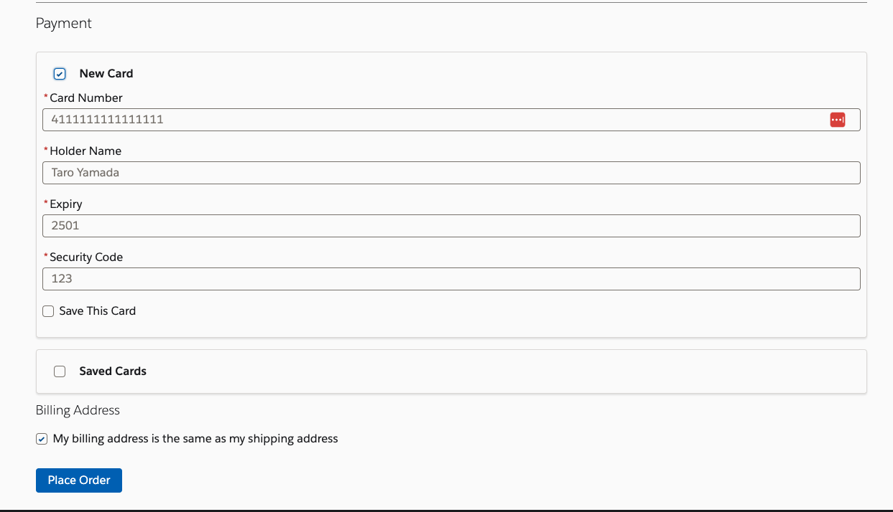
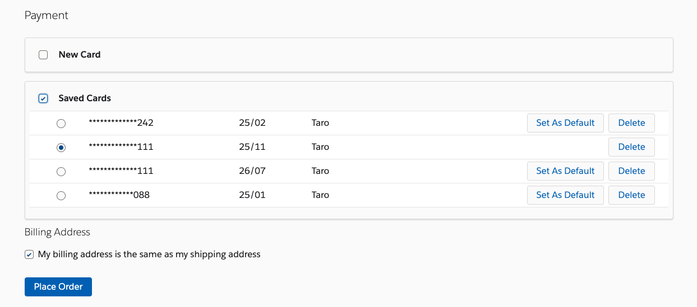
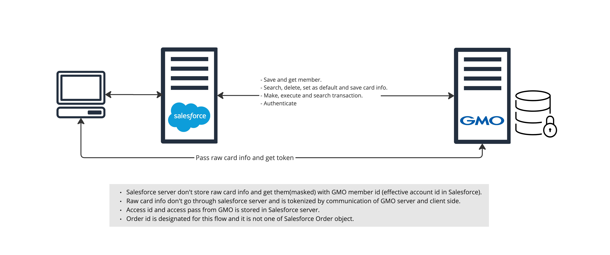
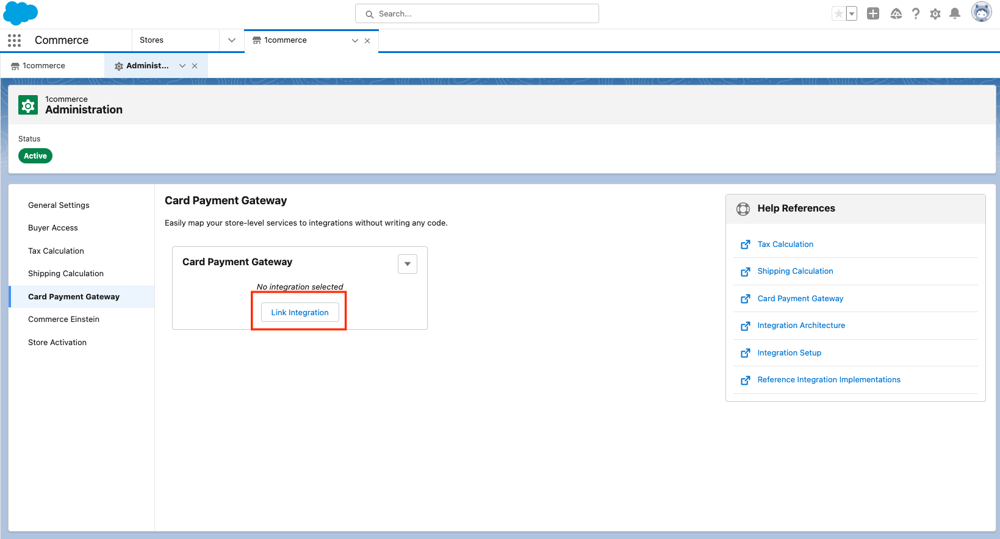
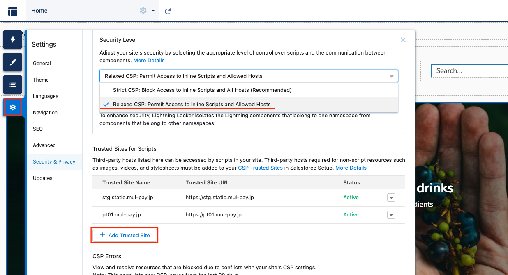
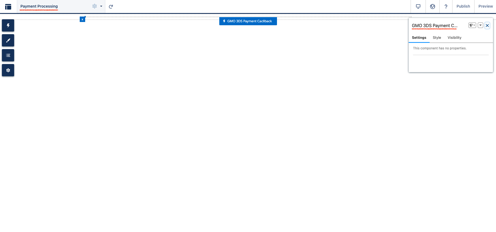

# Sample GMO payment adapter/component
This sample package contain component to implement client side tokenization flow payment with 3DS.

You can use new card and save it.


You can choose a card from saved list.


## Structure


## Setting instruction
1. Push/Deploy sources to your org.
1. Go to **Setup > Custom Metadata Types** and input `{your site}/{root path}/payment-processing` (e.g. `https://sample.develop.my.site.com/yoursite/payment-processing`) to `retUrl` field in GMOClientConfiguration record. About other fields, please check [detail about `GMOClientConfiguration`](#gmoclientconfigurationcustom-metadata).
1. Go to **Setup > Named Credentials** and replace `{your shop id}`, `{your shop pass}`, `{your site id}`, `{your site pass}` in GMOAdapterShop_NC and GMOAdapterSite_NC with GMO credentials. 
1. Create PaymentGateway record with command below. Replace `{your org user}` with user alies or ID of an org you prefer to use.
    ```
    sh scripts/shell/payment.sh -u {your org user} -a GMOPaymentAdapter -n GMOAdapterShop_NC
    ```
1. Select `GMOPaymentAdapter_Gateway` in Link Integration setting
    
1. Set up Trusted Sites in Experience Builder for `https://stg.static.mul-pay.jp` and `https://pt01.mul-pay.jp`.
    
1. Assign access to Apex `GMOPaymentController` to shopper profile. (**Setup > Apex Classes > Security** in `GMOPaymentController`)
1. Go to Experience Builder and drag and drop `GMO 3DS Payment Cacllback` to Payment Processing page.
    

## GMOClientConfiguration(Custom Metadata)

|Name|Description|
|-|-|
|useUserId|Check this value if you want use user id for member id of GMO (effective account id is used as default)|
|tdFlag|Check descripttion of `TdFlag` property in [EntryTran in GMO doc](https://docs.mul-pay.jp/payment/credit/api3ds2#entrytran)|
|tdTenantName|Check descripttion of `TdTenantName` property in [EntryTran in GMO doc](https://docs.mul-pay.jp/payment/credit/api3ds2#entrytran)|
|tds2Type|Check descripttion of `Tds2Type` property in [EntryTran in GMO doc](https://docs.mul-pay.jp/payment/credit/api3ds2#entrytran)|
|tdRequired|Check descripttion of `TdRequired` property in [EntryTran in GMO doc](https://docs.mul-pay.jp/payment/credit/api3ds2#entrytran)|
|retUrl|Check descripttion of `RetUrl` property in [ExecTran in GMO doc](https://docs.mul-pay.jp/payment/credit/api3ds2#exectran)|
|tds2ChallengeIndType|Check descripttion of `Tds2ChallengeIndType` property in [ExecTran in GMO doc](https://docs.mul-pay.jp/payment/credit/api3ds2#exectran)|
|jsUrl|URL for token.js of GMO|
|shopId|GMO shop ID|
|shopNC|Named Credentials to access GMO shop API|
|shopPass|GMO shop password|
|siteId|GMO site ID|
|siteNC|Named Credentials to access GMO site API|
|sitePass|GMO site password|


## Request type mapping 
### [REST API](https://developer.salesforce.com/docs/atlas.en-us.240.0.chatterapi.meta/chatterapi/connect_resources_payments.htm)
`/commerce/payments/authorizations` -> `Authorize`  
`/commerce/payments/authorizations/authorizationId/captures` -> `Capture`  
`/commerce/payments/authorizations/authorizationId/reversals` -> `AuthorizationReversal`  
`/commerce/payments/payments/paymentId/refunds` -> `ReferencedRefund`  
`/commerce/payments/sales` -> `Sale`  

### [Apex method](https://developer.salesforce.com/docs/atlas.ja-jp.apexcode.meta/apexcode/apex_ConnectAPI_Payments_static_methods.htm#unique_1099295387)
`authorize(authorizePayment)` -> `Authorize`  
`capture(AuthCaptureInput, authorizationId)`  -> `Capture`  
`reverseAuthorization(AuthReversalInput, authorizationId)` -> `AuthorizationReversal`  
`refund(ReferencedRefundInput, paymentId)`  -> `ReferencedRefund`  

### [SOM Core Action](https://help.salesforce.com/s/articleView?language=en_US&id=sf.flow_ref_elements_om_actions_list.htm&type=5)
`Ensure Funds Async` -> `Capture`  
`Ensure Refunds Async` -> `ReferencedRefund`  

## For production
This package use urlsfor GMO staging environment (e.g. `https://stg.static.mul-pay.jp`). Please change urls and credentials in metadata, named credentials and remote setting accordingly to go production.

## GMO test card
[Test cards](https://mp-faq.gmo-pg.com/s/article/DA046)

## Out of scope (as of 2023/05)
- Showing card brand logo
- SOM related functions