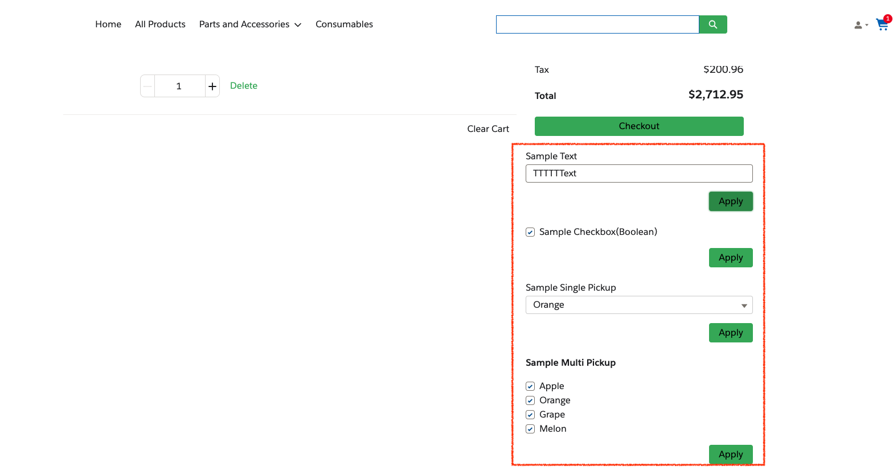
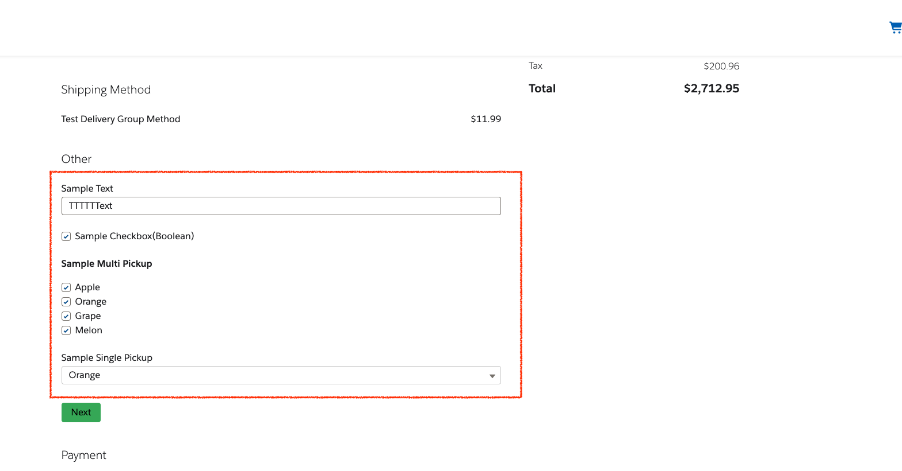
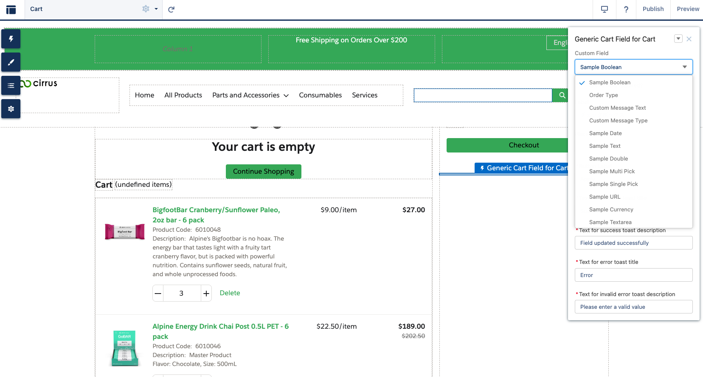
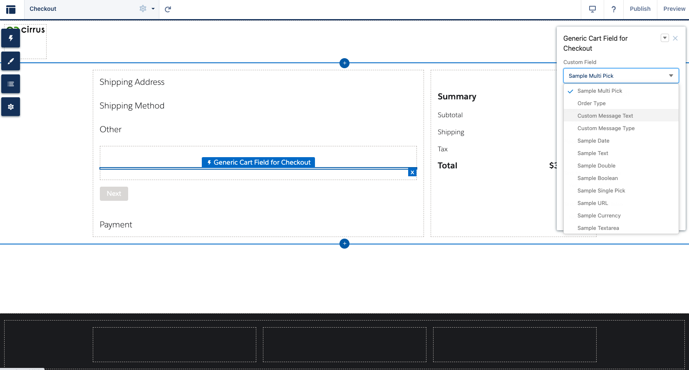

# Sample generic cart field component
This package contain 2 components to update custom field of WebCart object.

1. For cart page
    
1. For checkout page
    

## Component setting instruction
1. Push/Deploy sources to your org.
1. Assign access to Apex `GenericCartFieldController` to shopper profile. (Setup > Apex Classes > Security in GenericCartFieldController)

## Usage
1. Create custom field to WebCart object.   
1. (In cart page) Drag and drop `Generic Cart Field for Cart` component
    - 
1. (In checkout page) Drag and drop `Generic Cart Field for Checkout` component
    - 
1. Input value to component properties.
1. Publish edited page.

## Note
- "Is this field required?" property is NOT related to object field required setting.
- Supported field type is written in [GenericCartFieldPickupList.cls](./force-app/main/default/classes/GenericCartFieldPickupList.cls)
- If you add same API name, same data type, and same field configuration (length, precision, field-level security, and so on) to Order object. Value is automatically mapped to it.(There is field type limitation. Please check detail in [help page](https://developer.salesforce.com/docs/atlas.en-us.b2b_b2c_comm_dev.meta/b2b_b2c_comm_dev/b2b_b2c_comm_import_export_carttoorder.htm).)

