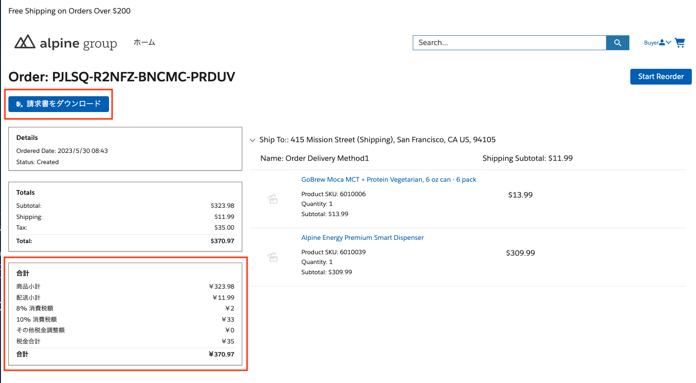
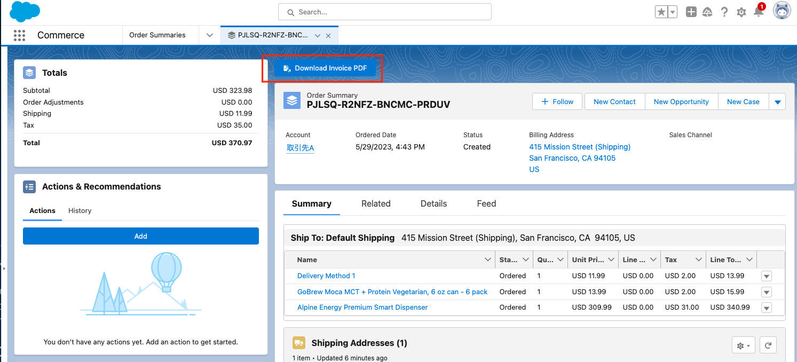
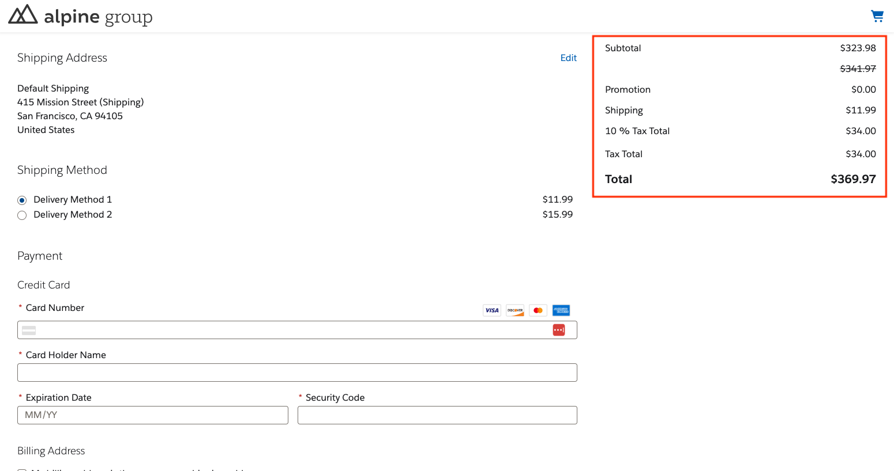
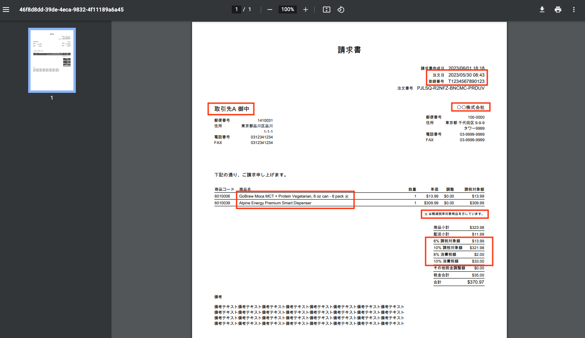
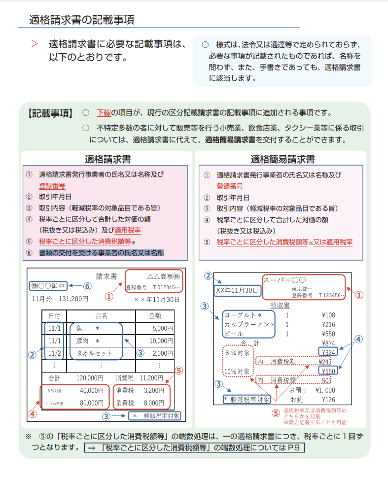

# Sample components for japan taxation

## Prerequirement

- [Has to enable translation workbench](https://help.salesforce.com/s/articleView?id=sf.wcc_setup_enable_translation.htm&type=5)
- [Has to be multi currency organization](https://help.salesforce.com/s/articleView?id=sf.admin_enable_multicurrency.htm&type=5)

## Setup Instruction
1. Deploy all sources.
1. Go to Setup -> Custom Code -> APEX Classes. On the `JapanTaxController` and `JapanTaxInvoiceVFPDFController` class, click "Security". Assign the buyer user profile(s) or other user profiles that will use your components.
1. Go to Setup -> Custom Code -> Visualforce Pages. On the `JapanTaxInvoiceVFPDF`, click "Security". Assign the buyer user profile(s) or other user profiles that will use your components.

## Components

### Japan Tax Order Summary Totals & Japan Tax Invoice PDF Download Button (Experience)

These compoenents work in order detail page in B2B/D2C Commerce on LWR experirnce site.

### Japan Tax Invoice PDF Download Button (Platform)

These compoenents work in order summary record page on platform.

## Japan Tax Checkout Summary

This component show with tax by rate in checkout summary.

## Sample Invoice PDF

This invoice is displayed following [rule tax](https://www.nta.go.jp/taxes/shiraberu/zeimokubetsu/shohi/keigenzeiritsu/pdf/0020006-027.pdf).
You can modify layout by editing `force-app/main/default/pages/JapanTaxInvoiceVFPDF.page` file.

