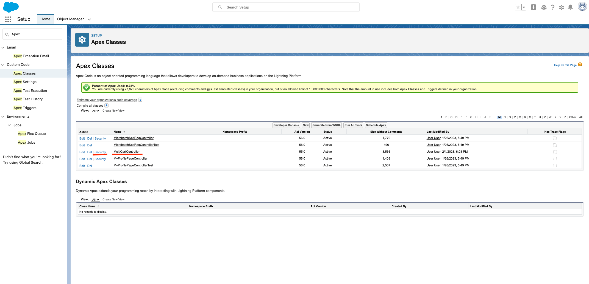
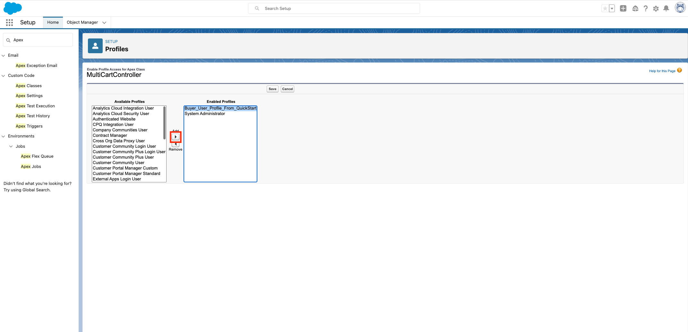
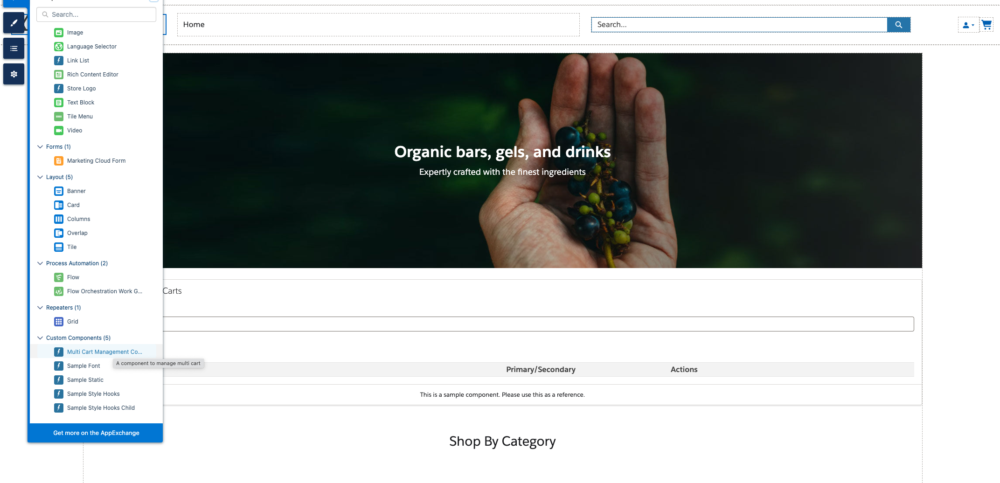

# Sample multi cart management component
You can manage multi cart (create, delete, set as promary) with this component

## Setting Instruction
1. Give profile assigned to login user an access to Apex class `MultiCartController`.
    
    

1. Drag and drop a component named `Multi Cart Management Component` to place you prefer to.
    

