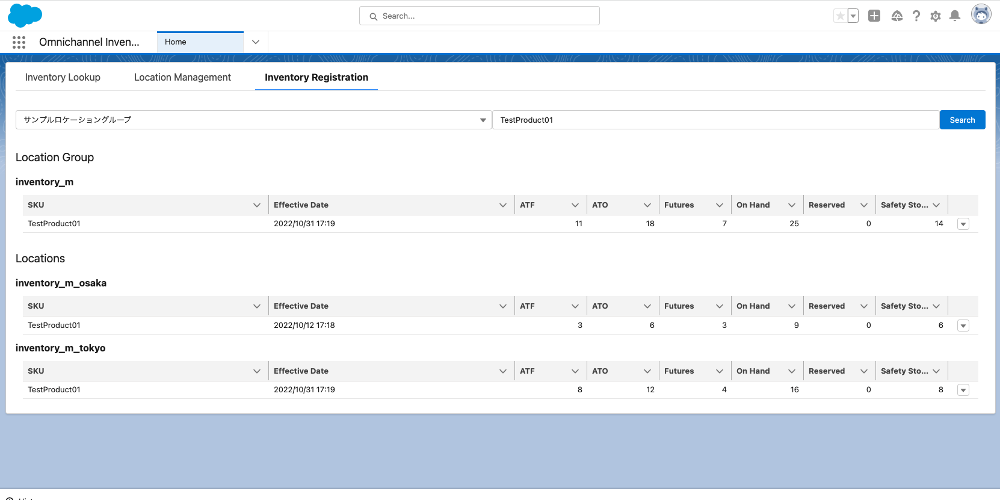
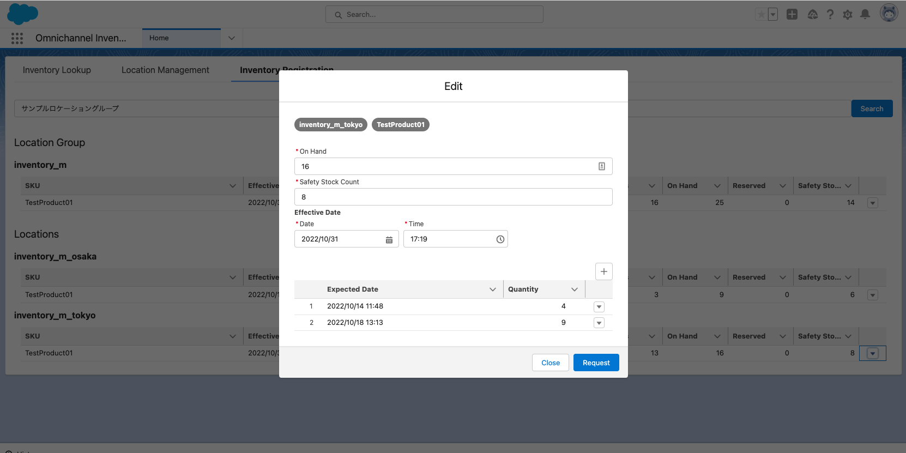
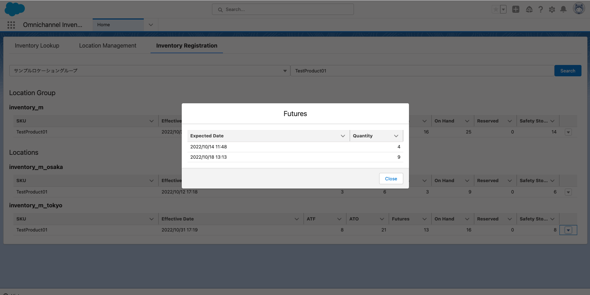
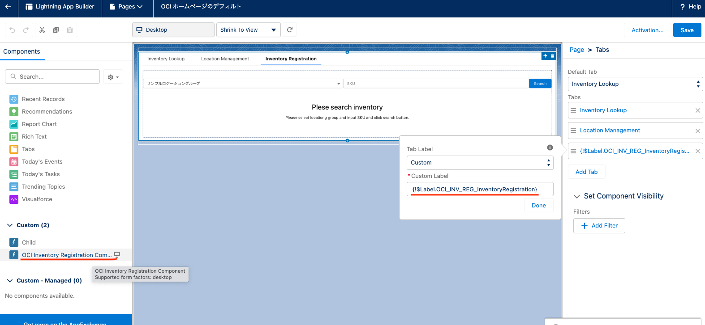

# Sample OCI inventory registration component
This component is used to edit inventory info in Salesforce platform.

You can see list of locations. 


You can edit inventory info.


You can see future inventory info.


## Setup instruction
1. Grant permissions to the APEX class
   1. Go to Setup -> Custom Code -> APEX Classes.
   1. On the `OciInvRegController` class, click "Security".
   1. Assign operater profile(s).
   1. Click Save.

## Add this component to page
You can add this component named "OCI Inventory Registration Component" to any page and you can also use custom label named "{!$Label.OCI_INV_REG_InventoryRegistration}".




## Sample Data
```
sfdx force:apex:execute -f ./scripts/apex/data.apex -u {username or alias}
```

