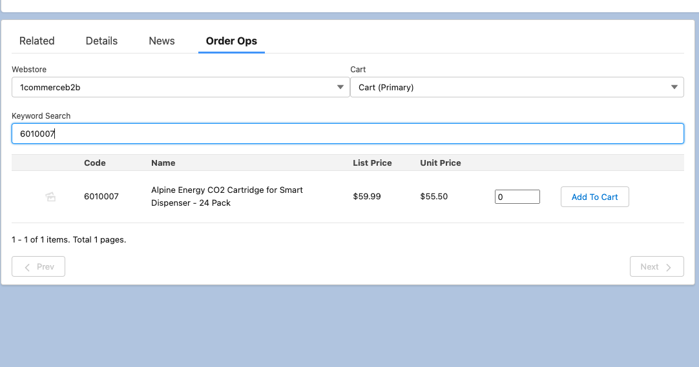
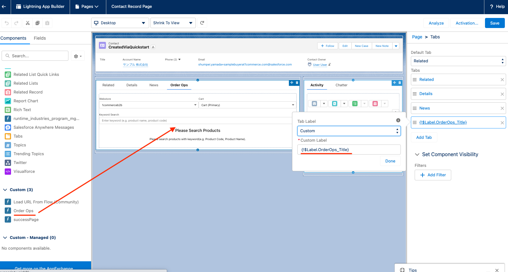

# Sample order operation component
 This package provide order pad which you can add items to cart on behalf of customer.

 

 ## Setting Instruction
 This component is available on only contact record page.

## Setup instruction
1. Grant permissions to the APEX class
   1. Go to Setup -> Custom Code -> APEX Classes.
   1. On the `OrderOpsController` class, click "Security".
   1. Assign operater profile(s).
   1. Click Save.
1. Go to application builder for contact page
1. Drag and drop component "Order Pad" to any space
1. You can use `{!$Label.OrderOps_Title}` as label as you want.
   