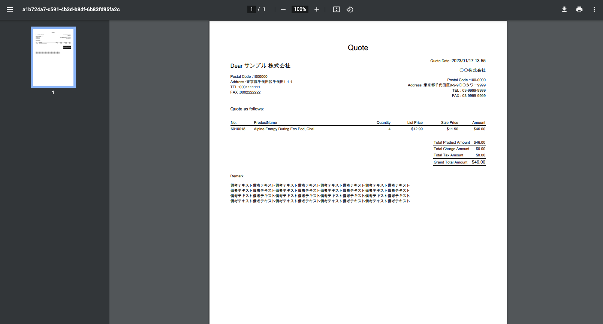
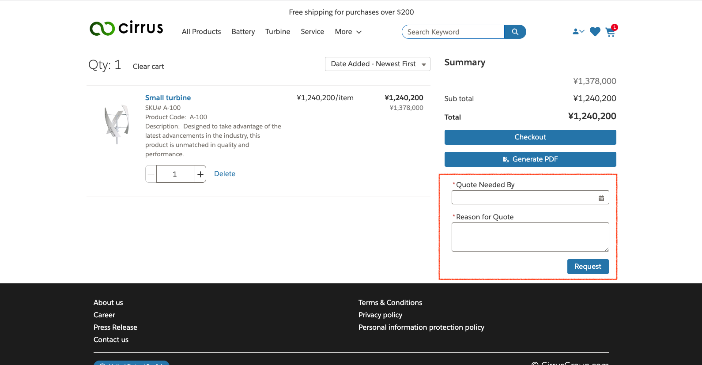
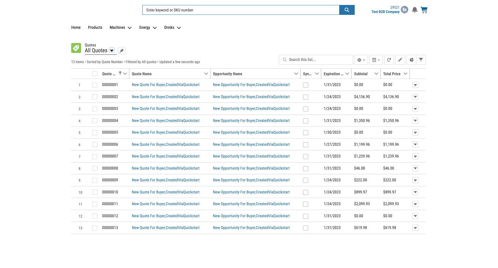
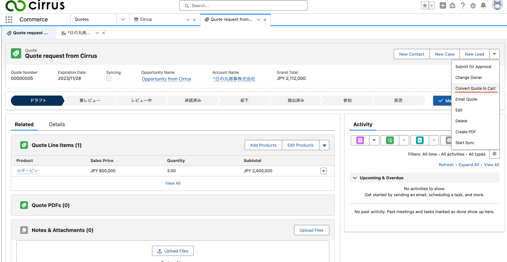

# Sample quote components

This package contain 3 components and 1 flow.

#### Conponents

1. Button to genarate quote PDF with cart information.
1. Screen flow to request quote
1. Link to quote list view

#### Flows

1. Convert quote to cart

## Components

### Button to genarate quote PDF with cart information

In Experience Builder, you can drag and drop `Quote Visualforce PDF` component to cart page. When you click the button, PDF is genarated and popup new window to show it.

### Screen flow to request quote

In Experience Builder, you can drag and drop `Quote Request` component to cart page. In cart page, you can fill out request form and submit it.

**Note**
You can modify logic to create Quote object in flow `[Quote] Request a Quote`.

### Link to quote list view

**Warning**
This component is available only if you have license which is allowed to use Quote object and user is assigned profile which have access to it.(Please check [License Detail](https://help.salesforce.com/s/articleView?id=sf.users_license_types_communities.htm&type=5))

In Experience Builder, you can drag and drop `Quote Request` component to any page. When you click the link, Quote list is shown (Image is sample of Aura). About record page, please refer to [help](https://help.salesforce.com/s/articleView?id=sf.community_builder_page_type_object.htm&type=5)

## Flows

### Convert quote to cart

You can add quick action `Convert Quote to Cart` to run flow `[Quote] Convert Quote to Cart`.

## Setting instruction

1. [Enable quote setting](https://help.salesforce.com/s/articleView?id=sf.quotes_enable.htm&type=5)
1. Deploy this resource
1. Grant permissions to the APEX class
   1. Go to Setup -> Custom Code -> APEX Classes.
   1. On the `QuoteVFPDFController` and `QuoteRequestController` class, click "Security".
   1. Assign buyer or operater profile(s).
   1. Click Save.
1. Grant permissions to the Visualforce class
   1. Go to Setup -> Custom Code -> Visualforce Pages.
   1. On the `QuoteVFPDF` page, click "Security".
   1. Assign buyer or operater profile(s).
   1. Click Save.
1. Grant permissions to the flow
   1. Go to Setup -> Profile and click buyer or operater profile(s).
   1. Click Flow Access and click edit button.
   1. Select `[Quote] Request a Quote` and `[Quote] Back Quote To Cart`.
   1. Click Save.
