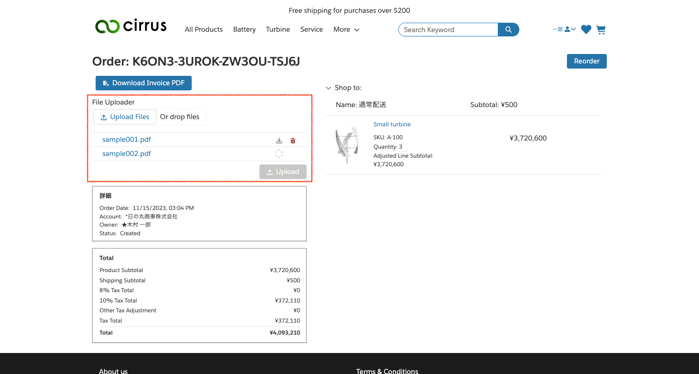
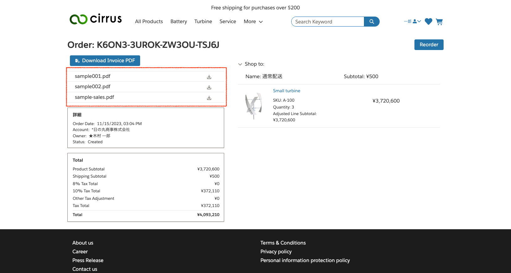
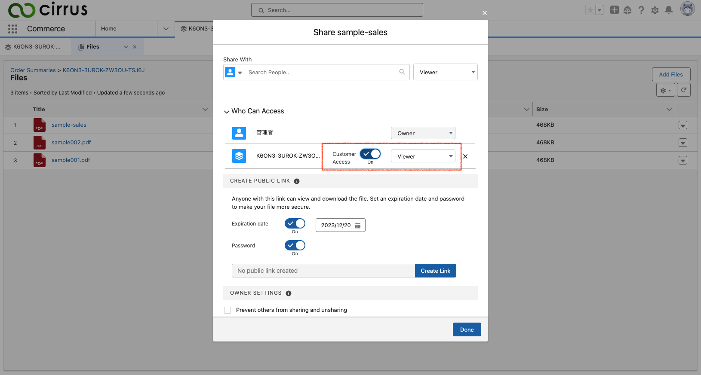

# Sample record files component

This package contain 2 components to opearte [Salesforce Files](https://help.salesforce.com/s/articleView?id=sf.collab_files_overview.htm&type=5)

1. Uploader to view and upload files attached to a record.
1. Viewer to view files attached to a record.

## Components

### Uploader

In Experience Builder, you can drag and drop `Record File Uploader` component to record page (e.g. order history detail page).
You can uploade multiple files to share them with platform user (e.g. sales representative) and view, download and delete them.

### Viewer

In Experience Builder, you can drag and drop `Record File Viewer` component to record page (e.g. order history detail page).
You can view, download files platform user (e.g. sales representative) share with you.

#### To share file with buyer from platform user

You need to toggle `Customer Access` in file share setting.

## Setting instruction

1. Deploy this resource
1. Grant permissions to the APEX class
   1. Go to Setup -> Custom Code -> APEX Classes.
   1. On the `RecordFileController` class, click "Security".
   1. Assign buyer profile(s).
   1. Click Save.
