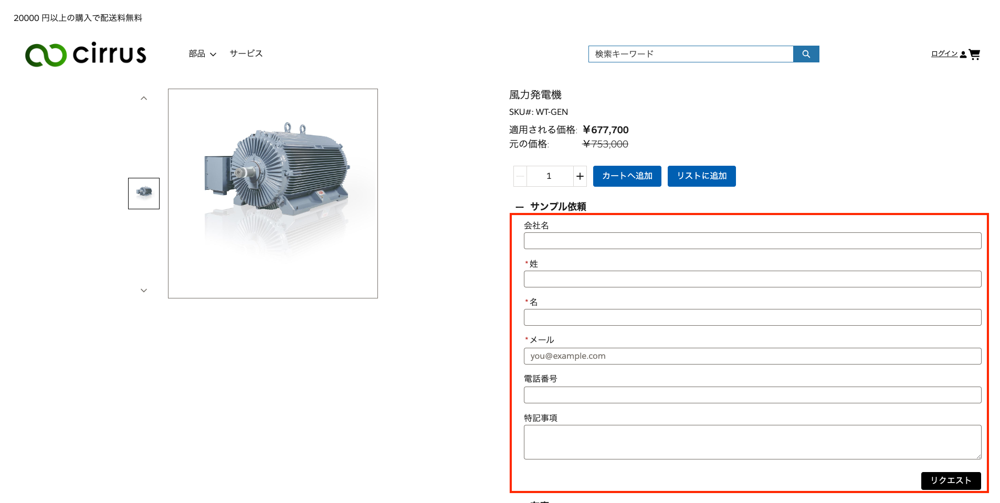

# Sample sample product request component
This package is used to request sample product on PDP

## Component
### Sample Product Request
You can put "Sample Product Request" component on PDP. and this invoke "[Sample Product] Request Sample Product" flow.

## Setup Instruction
1. Deploy all sources.
1. Grant permissions to the flow
    1. Go to Setup -> Profile and click buyer or operater profile(s).
    1. Click Flow Access and click edit button.
    1. Select `[Sample Product] Request Sample Product`.
    1. Click Save.
1. Add user to notification queue
    1. Go to Setup -> User -> Queues
    1. Edit `ToDo_Assign_Queue` queue
    1. Add users who you want to notify when sample product was requested as queue member.